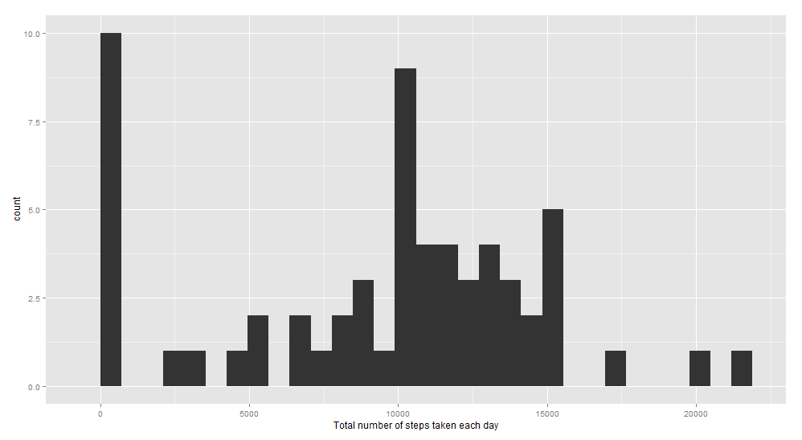
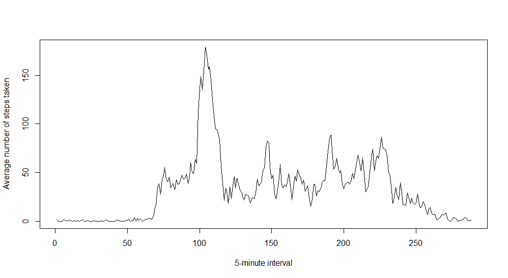
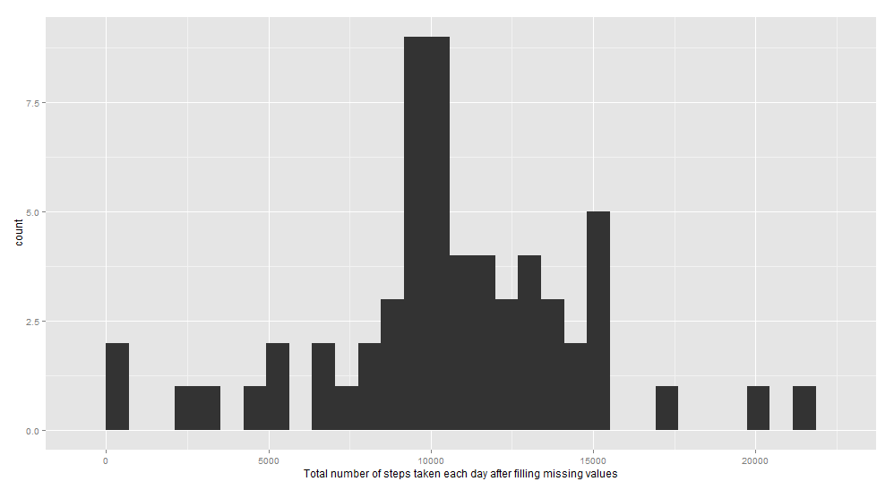
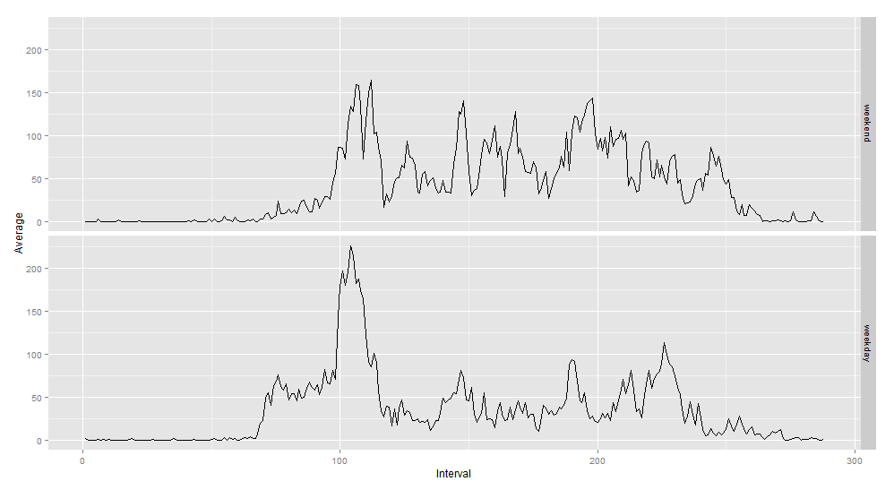

---
title: "Reproducible Research: Peer Assessment 1"
output: 
  html_document:
    keep_md: true
---

```r
require(knitr)
opts_chunk$set(echo = TRUE, cache = TRUE, cache.path = "cache/", fig.path = "instructions_fig/")
```
_________________________________________
## Loading and preprocessing the data
- Data1 : Raw dataset       (17568 rows)
- Data2 : Completed dataset (15264 rows)


```r
        Data1 <- read.csv("activity.csv")
        CC<-complete.cases(Data1)
        Data2<-Data1[CC,]
```


_________________________________________
## What is mean total number of steps taken per day?
- SumPerDay : new Data Frame containing Date and the sum of steps taken per day.


```r
        lv<-levels(Data2$date)
        SumPerDay<-data.frame(Date=character(),Sum=numeric())
        for (i in 1:length(lv)){
            Data3<-Data2[Data2$date %in% lv[i], ]
            Sum<-sum(Data3$steps)
            SumPerDay<-rbind(SumPerDay, data.frame(Date=lv[i],Sum=Sum))
        }
```

###1. Histogram of the total number of steps taken each day


```r
        install.packages("ggplot2")
        library(ggplot2)
```


```r
        qplot(Sum, data=SumPerDay, xlab="Total number of steps taken each day")
```

 

###2. Mean and Median number of steps taken each day


```r
        Mean<-mean(SumPerDay$Sum)
        Median<-median(SumPerDay$Sum)
```

        The Mean of steps taken each day is 9354.2295082.
        The Median of steps taken each day is 10395.


_________________________________________
## What is the average daily activity pattern?
- AvgInt : new Data Frame containing the average number of steps taken for each 5-minute interval.


```r
        Data2$interval<-factor(Data2$interval)
        lv2<-levels(Data2$interval)
        AvgInt<-data.frame(Average=numeric(),Interval=numeric())
        for (i in 1:length(lv2)){
                Data4<-Data2[Data2$interval %in% lv2[i], ]
                Average<-sum(Data4$steps)/61
                AvgInt<-rbind(AvgInt, data.frame(Interval=lv2[i],Average=Average))
        }
```

###1. Time series plot of the average number of steps taken (averaged across all days) versus the 5-minute intervals


```r
        plot(as.numeric(AvgInt$Interval),AvgInt$Average, xlab="5-minute interval", ylab="Average number of steps taken", type="l")
```

 

###2. The 5-minute interval containing the maximum number of steps 


```r
        Max<-AvgInt[AvgInt$Average == max(AvgInt$Average),]
        MaxInt<-Max$Interval
```

        The 5-minute interval containing the maximum number of steps is 835.


_________________________________________
## Imputing missing values


###1. Strategy for imputing missing data
- Missing valuse in the dataset : 


```r
        CC<-complete.cases(Data1)
        Miss<-sum(!CC)
```

        The total number of missing values in the dataset is 2304 rows.

- Data8New     : New Dataset with the missing data filled with the mean for that 5-minute interval.
- SumPerDayNew : new Data Frame containing Date and the sum of steps taken per day after filling missing values.


```r
        Data5<-Data1[!CC, ]        
                Data7NaFix<-Data2[0,]
                for (i in 1:length(lv2)){
                        
                        Data6<-Data5[Data5$interval == lv2[i], ]
                        Data6$steps<-AvgInt[i,2]
                        Data7NaFix<-rbind(Data7NaFix, Data6)
                }
        
        Data8New<-rbind(Data2, Data7NaFix)
        SumPerDayNew<-data.frame(Date=character(),Sum=numeric())
                for (i in 1:length(lv)){
                        Data9<-Data8New[Data8New$date %in% lv[i], ]
                        SumNew<-sum(Data9$steps)
                        SumPerDayNew<-rbind(SumPerDayNew, data.frame(Date=lv[i],Sum=SumNew))
                }
        Mean2<-mean(SumPerDayNew$Sum)
        Median2<-median(SumPerDayNew$Sum)
```
        
###2. Histogram of the total number of steps taken each day after missing values were imputed


```r
        qplot(Sum, data=SumPerDayNew, xlab="Total number of steps taken each day after filling missing values")
```

 

        The Mean of steps taken each day after filling missing valuesis 1.0581014 &times; 10<sup>4</sup>.
        The Median of steps taken each day after filling missing valuesis 1.0395 &times; 10<sup>4</sup>.


_________________________________________
## Are there differences in activity patterns between weekdays and weekends?

###1. Panel plot comparing the average number of steps taken per 5-minute interval across weekdays and weekends


```r
        Data8New$wk<-factor(weekdays(as.Date(Data8New$date)) %in% c("Saturday","Sunday"))
        AvgInt2<-data.frame(Average=numeric(),Interval=numeric(),WK=character())
        AvgInt3<-data.frame(Average=numeric(),Interval=numeric(),WK=character())
        Data10wk<-Data8New[Data8New$wk==TRUE, ]
        Data11wd<-Data8New[Data8New$wk==FALSE, ]
        wkd<-sum(weekdays(as.Date(levels(Data8New$date))) %in% c("Saturday","Sunday"))
        wdd<- as.numeric(61-wkd)
        
        for (i in 1:length(lv2)){
                Data10a<- Data10wk[ Data10wk$interval %in% lv2[i], ]
                Average<-sum(Data10a$steps)/wkd
                AvgInt2<-rbind(AvgInt2, data.frame(Interval=lv2[i],Average=Average, WK="weekend"))
        }
                
        for (i in 1:length(lv2)){
                Data11a<- Data11wd[ Data11wd$interval %in% lv2[i], ]
                Average<-sum(Data11a$steps)/wdd
                AvgInt3<-rbind(AvgInt3, data.frame(Interval=lv2[i],Average=Average, WK="weekday"))
        }
        AvgIntByWD<-rbind(AvgInt2,AvgInt3)
        AvgIntByWD$Interval<-as.numeric(AvgIntByWD$Interval)
        g<-ggplot(AvgIntByWD,aes(Interval, Average))
        g+geom_line()+facet_grid(WK~.)
```

 

